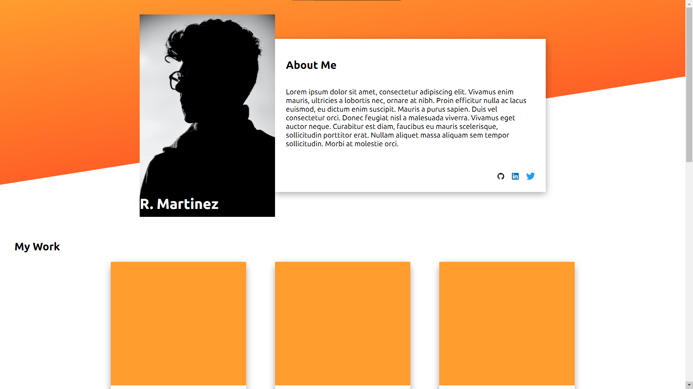
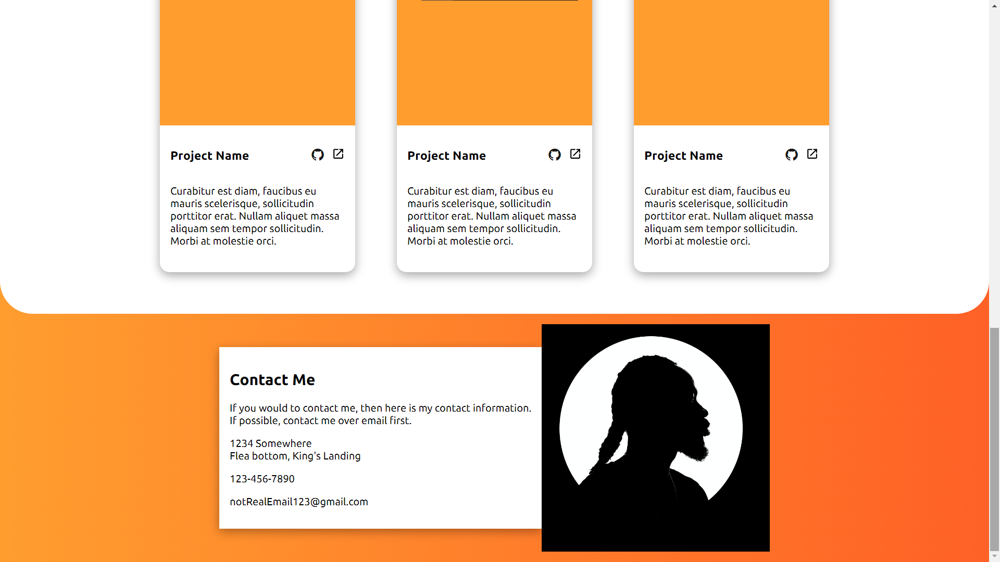

# Dashboard
[Link to live demo.](https://rosendo-martinez.github.io/homepage/) 👈

This project is a mock portfolio website that I made. It works and looks good on laptops, tablets, and phones!

Tech used: CSS, HTML

# Screenshots

This project is an [assignment](https://www.theodinproject.com/lessons/node-path-advanced-html-and-css-homepage) from TOP's [Fullstack Javascript Developer Course](https://www.theodinproject.com/paths/full-stack-javascript). 